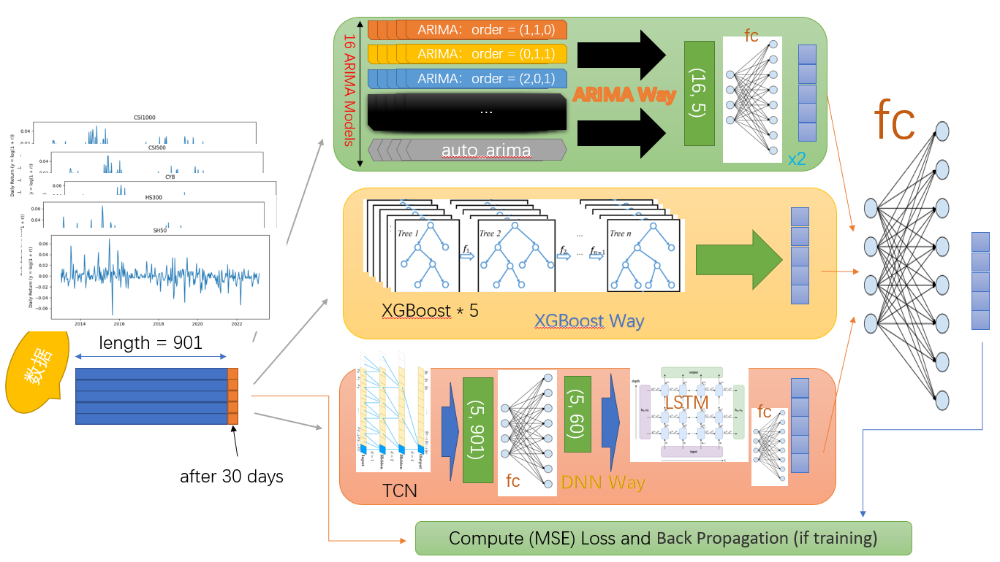

## Global Model

## And...
- please see `show.ipynb` for more details
- __Note that the confunsion matrix in show.ipynb is wrong__
    1. the x-axis and y-axis should swap
    2. in each axis, 0 and 1 should swap, too

## More..
- Some properties are added into the source code but not put onto `show.ipynb`, for some reasons.
